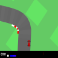
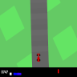
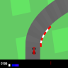
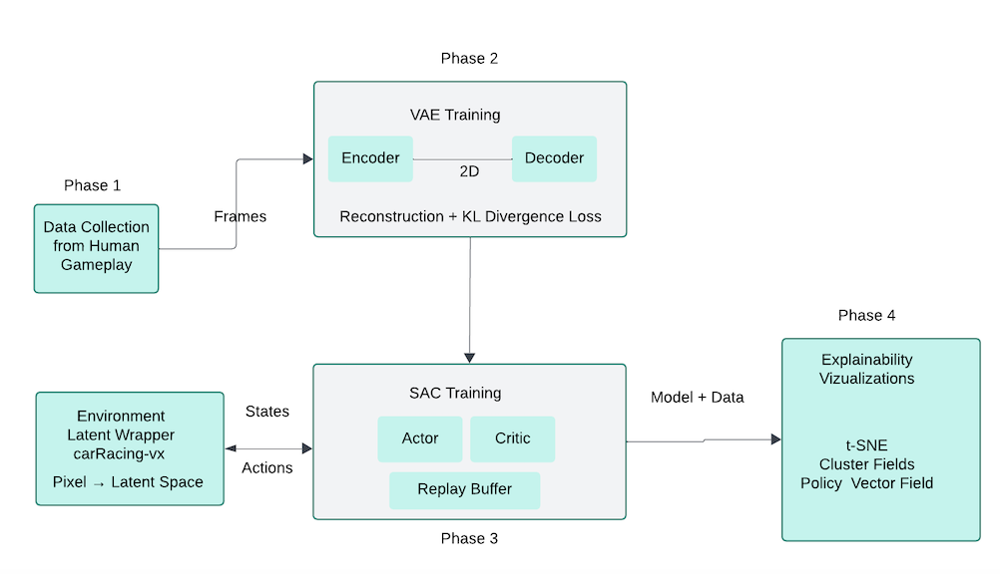
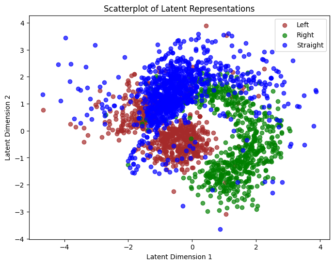
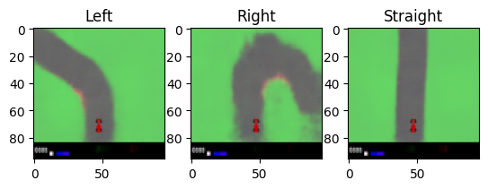

# Columbia-ManifoldRL
Final Project for Reinforcement Learning Course

We trained an agent to drive a car via reinforcement learning based on the Car Racing simulator game from OpenAI Gym.
Then we analyzed the agent's representation of the Car Racing simulation using an explainable 2D signal, or manifold.

## Overview

### Preprocessing

We have over 2,000 screen captures from the Car Racing simulator.

Each is the same 96x96 colored resolution as the model input.
They also have labels: left, right or straight for the direction of the car.
For example, see 3 samples:

LEFT: 
STRAIGHT: 
RIGHT: 

### Pretraining with Manifold Learning

We use a variational autoencoder to learn low-dimensional representations for the state space.

This is pretraining: the objective is to simply reconstruct the original input image after passing through a 2D bottleneck.

### Finetuning via Reinforcement Learning

With the explainable representations, the agent learns to operate the car from the 2D signal

## Result

### Explainable Pretraining

The VAE successfully seperates different turns as expected:

